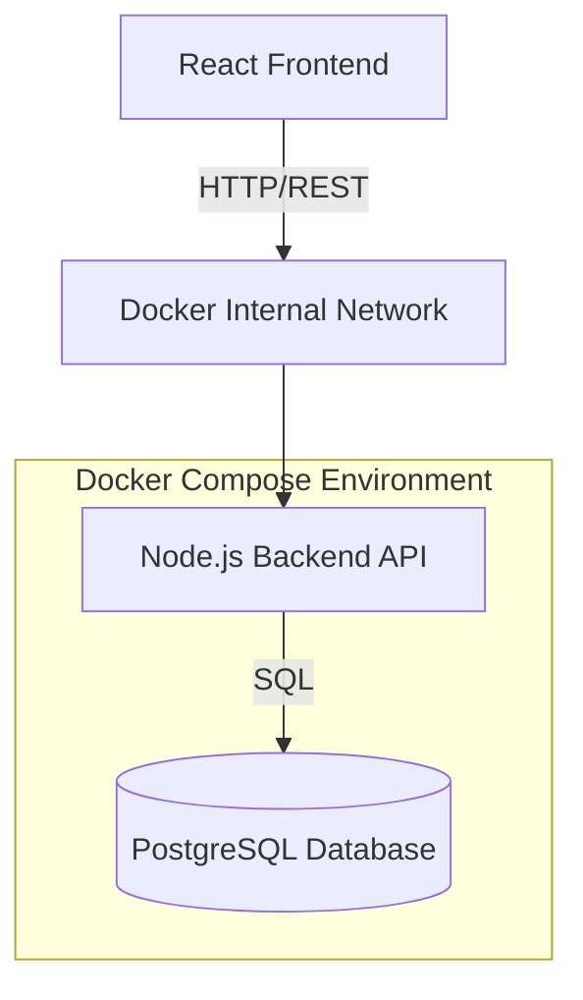
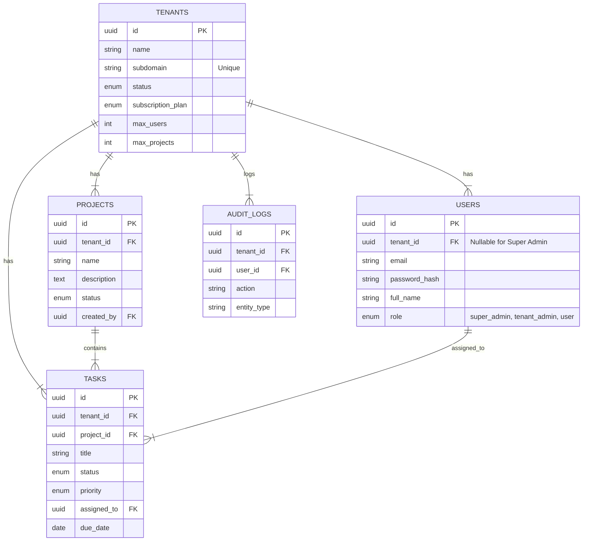

# System Architecture

## 1. High-Level Architecture

The system follows a classic **3-Tier Web Architecture**, fully containerized using **Docker**.

### Components

#### Client Layer (Frontend)

* **Technology:** React.js, Context API
* **Role:** Single Page Application (SPA) running in the user's browser
* **Communication:** Interacts with backend strictly via REST APIs using Axios

#### Service Layer (Backend)

* **Technology:** Node.js, Express.js
* **Role:**

  * Handles business logic
  * JWT-based authentication
  * Enforces multi-tenancy isolation via middleware

#### Data Layer (Database)

* **Technology:** PostgreSQL 15
* **Role:**

  * Persists all relational data
  * Uses foreign keys to maintain integrity
  * Indexes on `tenant_id` for performance

---

## 2. Database Entity Relationship Diagram (ERD)

The system uses a **Shared Database / Shared Schema** approach. To enforce tenant isolation, a `tenant_id` foreign key is present in all tenant-specific tables.

---

## 3. API Architecture

The application exposes **19 RESTful endpoints**, organized by resource modules.

---

### 3.1 Authentication Module

| Method | Endpoint                    | Description                       | Auth Required | Role Access |
| ------ | --------------------------- | --------------------------------- | ------------- | ----------- |
| POST   | `/api/auth/register-tenant` | Register new organization & admin | No            | Public      |
| POST   | `/api/auth/login`           | Login user                        | No            | Public      |
| GET    | `/api/auth/me`              | Get current user & tenant info    | Yes           | All         |
| POST   | `/api/auth/logout`          | Logout user                       | Yes           | All         |

---

### 3.2 Tenant Management Module

| Method | Endpoint           | Description           | Auth Required | Role Access                |
| ------ | ------------------ | --------------------- | ------------- | -------------------------- |
| GET    | `/api/tenants`     | List all tenants      | Yes           | Super Admin                |
| GET    | `/api/tenants/:id` | Get tenant details    | Yes           | Super Admin, Tenant Member |
| PUT    | `/api/tenants/:id` | Update tenant details | Yes           | Super Admin, Tenant Admin  |

---

### 3.3 User Management Module

| Method | Endpoint                 | Description         | Auth Required | Role Access        |
| ------ | ------------------------ | ------------------- | ------------- | ------------------ |
| POST   | `/api/tenants/:id/users` | Add user to tenant  | Yes           | Tenant Admin       |
| GET    | `/api/tenants/:id/users` | List tenant users   | Yes           | Tenant Member      |
| PUT    | `/api/users/:id`         | Update user details | Yes           | Tenant Admin, Self |
| DELETE | `/api/users/:id`         | Delete user         | Yes           | Tenant Admin       |

---

### 3.4 Project Management Module

| Method | Endpoint            | Description    | Auth Required | Role Access           |
| ------ | ------------------- | -------------- | ------------- | --------------------- |
| GET    | `/api/projects`     | List projects  | Yes           | Tenant Member         |
| POST   | `/api/projects`     | Create project | Yes           | Tenant Member         |
| PUT    | `/api/projects/:id` | Update project | Yes           | Tenant Admin, Creator |
| DELETE | `/api/projects/:id` | Delete project | Yes           | Tenant Admin, Creator |

---

### 3.5 Task Management Module

| Method | Endpoint                  | Description         | Auth Required | Role Access   |
| ------ | ------------------------- | ------------------- | ------------- | ------------- |
| GET    | `/api/projects/:id/tasks` | List project tasks  | Yes           | Tenant Member |
| POST   | `/api/projects/:id/tasks` | Create task         | Yes           | Tenant Member |
| PUT    | `/api/tasks/:id`          | Update task details | Yes           | Tenant Member |
| PATCH  | `/api/tasks/:id/status`   | Update task status  | Yes           | Tenant        |
